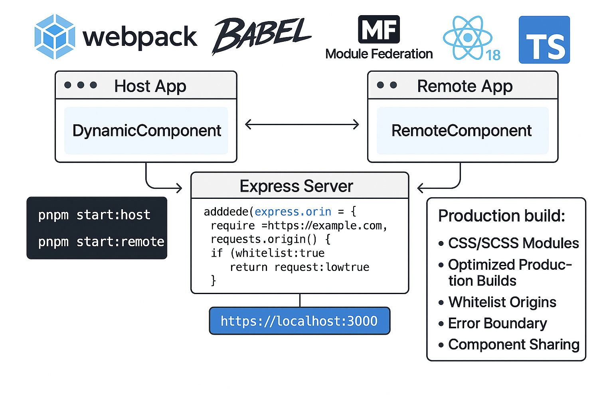

# 🚀 TypeScript Microfrontend Monorepo Kit - RSpack

<!--  -->

A production-ready monorepo boilerplate for building scalable microfrontend applications, powered by
modern web technologies and best practices. Built entirely from scratch without using any cli tools,
providing complete control over the build configuration and development workflow.

## Table of Contents

- [🎯 Overview](#-overview)
- [✨ Key Features](#-key-features)
- [⚙️ Technology Stack](#-technology-stack)
- [📁 Project Structure](#-project-structure)
- [🚀 Getting Started](#-getting-started)
- [🛠 Development Tools](#-development-tools)
- [🏗 Architecture](#-architecture)
- [🔒 Security](#-security)
- [📦 Deployment](#-deployment)
- [🤝 Contributing](#-contributing)
- [📄 License](#-license)

## 🎯 Overview

This monorepo provides a complete foundation for building scalable microfrontend applications. It
solves several key challenges in modern web development:

- 🏢 **Microfrontend Architecture**: Implement independent, deployable frontend applications that
  work together seamlessly
- 🔄 **Code Sharing**: Share components and logic between applications efficiently using Rspack
  Module Federation
- 📝 **Type Safety**: Full TypeScript support across all applications and packages
- ⚡️ **Development Workflow**: Streamlined development experience with hot reloading and custom CLI
  tools
- 🛡️ **Security**: Built-in protection for remote module access using Rspack's setupMiddlewares
- 📈 **Scalability**: Monorepo structure that scales with your team and application needs
- 🎛️ **Full Configuration Control**: Custom Rspack configuration built from ground up, offering
  maximum flexibility

## ✨ Key Features

### 🎨 Core Features

- ⚡️ Rspack Module Federation for component sharing
- 🔒 Secure Rspack dev server with setupMiddlewares for remote module access protection
- 🔄 Hot Module Replacement (HMR) support
- 📦 Optimized production builds
- 🎨 CSS/SCSS Modules support
- 🧪 Testing setup with Jest

### 🛠️ Custom Build Configuration

- 🎯 **Built From Scratch**: No black-box configurations from Create React App or Vite
- ⚙️ **Custom Rspack Setup**: Full control over build process and optimizations
- 🔧 **Extensible Configuration**: Easy to add new features and customize build behavior
- 📦 **Optimized Bundling**: Fine-tuned Rspack configuration for optimal performance
- 🔄 **Hot Reload**: Rspack's built-in development server with HMR
- 🎨 **Asset Handling**: Built-in support for various file types
- 🚀 **Performance Optimizations**:
  - Code splitting
  - Tree shaking
  - Chunk optimization
  - Dynamic imports
  - Module federation
  - Cache optimization

### 👨‍💻 Developer Experience

- 🛠 Custom dev-cli tool for workflow automation
- 📝 Comprehensive TypeScript support
- 🧹 Unified code formatting and linting
- ⚙️ Shared configurations for all tools
- 📚 Component library setup

## ⚙️ Technology Stack

- 🔧 **Core**: React 18, TypeScript, Rspack
- 🎨 **Styling**: CSS Modules, SCSS
- 📦 **Monorepo**: pnpm Workspaces, Lerna
- ✨ **Quality**: ESLint, Prettier, Jest
- 🛠 **Development**: Custom CLI, Rspack Dev Server with HMR
- 🏗 **Build**: Rspack optimizations

### 🎛️ Rspack Configuration Highlights

```javascript
// Example of the flexible Rspack configuration
module.exports = {
	// Core build optimization
	optimization: {
		splitChunks: {
			chunks: 'all',
			// Customizable chunking strategy
		},
		runtimeChunk: 'single',
	},

	// Module Federation for micro-frontends
	builtins: {
		federation: {
			// Customizable sharing strategy
			shared: {
				react: { singleton: true },
				'react-dom': { singleton: true },
			},
		},
	},

	// Rspack dev server with security middleware
	devServer: {
		setupMiddlewares: (middlewares, devServer) => {
			// Custom security middleware for remote module access
			devServer.app.use('/remoteEntry.js', (req, res, next) => {
				// Origin validation and access control
			});
			return middlewares;
		},
	},

	// Extensible module configuration
	module: {
		rules: [
			// TypeScript/JavaScript processing
			// CSS/SCSS handling
			// Asset optimization
			// Custom rule configurations
		],
	},
};
```

## 📁 Project Structure

```
├── apps/                # Microfrontend applications
│   ├── host/           # Host application
│   └── remote/         # Remote application
├── packages/           # Shared packages
│   ├── dev-cli/        # Development workflow tools
│   ├── ui/             # Shared UI components
│   ├── utils/          # Common utilities
│   └── configs/        # Shared configurations
├── scripts/            # Build and utility scripts
└── package.json        # Root package file
```

### 🔧 Build Configuration Structure

```
├── rspack/
│   ├── common.js        # Shared Rspack configuration
│   ├── development.js   # Development-specific settings
│   ├── production.js    # Production optimizations
│   └── module-fed.js    # Module Federation setup
```

## 🚀 Getting Started

### 📋 Prerequisites

- Node.js >= 18
- pnpm >= 9.0.0

### ⚡️ Installation

```bash
# Clone the repository
git clone https://github.com/your-username/ts-microfrontend-monorepo-kit.git

# Install dependencies
pnpm install

# Start development
pnpm dev
```

### 🔧 Development Commands

- `pnpm dev`: Start all applications in development mode
- `pnpm start:host`: Start host application
- `pnpm start:remote`: Start remote application
- `pnpm build`: Build all applications
- `pnpm lint`: Run linting
- `pnpm format`: Format code

## 🛠 Development Tools

### 🤖 Dev CLI (@repo/dev-cli)

Custom CLI tool that provides:

- 🔄 Workflow automation
- 🖥️ Development server management
- ⚡️ Build process optimization
- 🏗 Project scaffolding

Usage:

```bash
# Create a new component
dev-cli generate component

# Run development servers
dev-cli serve
```

### ⚙️ Shared Configurations

- 📝 TypeScript configurations
- 🧹 ESLint rules
- 🔧 Rspack configurations
- 🛠 Babel presets
- 🧪 Jest setup

## 🏗 Architecture

### 🏢 Microfrontend Implementation

1. **Host Application**: Main application shell

   - 🧭 Manages routing
   - 🔐 Handles authentication
   - 🎮 Orchestrates remote modules

2. **Remote Applications**: Independent features
   - 📦 Expose components via Module Federation
   - 🚀 Can be deployed independently
   - 💾 Maintain their own state and routing

### 🔄 Module Federation

- 📥 Dynamic loading of remote modules
- 🔄 Shared dependencies management
- ⚡️ Runtime integration of components
- 📈 Version control of shared modules

## 🔒 Security

### 🛡️ Remote Module Protection

- ✅ Origin validation using Rspack's setupMiddlewares
- 🔐 Configurable access controls
- 🌐 CORS protection
- ⚡️ Built-in security with Rspack dev server

### 📋 Best Practices

- 🔐 Secure module loading with setupMiddlewares
- 🛡️ Protected development endpoints
- ⚙️ Environment-based configurations
- 🔄 Error boundary implementation

## 📦 Deployment

### 🚀 Build Process

```bash
# Production build
pnpm build

# Environment-specific builds
NODE_ENV=staging pnpm build
```

### 📤 Output

- 📦 Optimized bundles
- 🗺️ Source maps
- 🎨 Asset optimization
- ⚡️ Cache management

## 🤝 Contributing

Please read [CONTRIBUTING.md](CONTRIBUTING.md) for details on our code of conduct and the process
for submitting pull requests.

## 📄 License

This project is licensed under the MIT License - see the [LICENSE.md](license.md) file for details.

---

## 💬 Support

For questions and support, please open an issue in the GitHub repository.

⭐️ If you find this project helpful, please give it a star!
