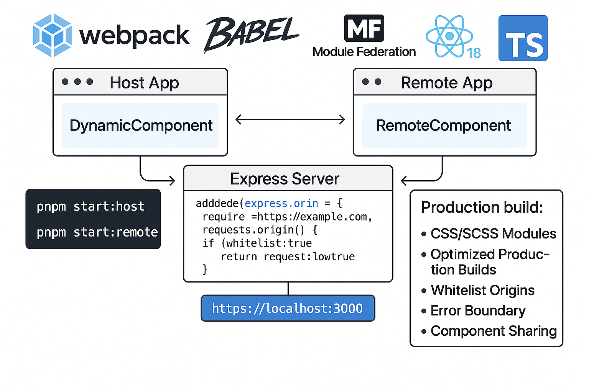
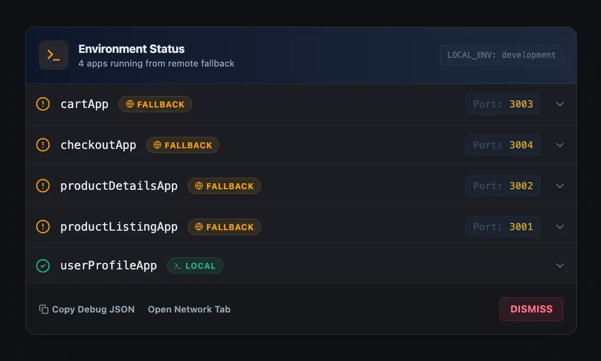

# TypeScript E-Commerce Microfrontends (Rspack + Module Federation)

<!--  -->

A production-ready monorepo for building scalable microfrontends with independent remotes, shared
state, and a router-driven host shell. Built from scratch for full control over Module Federation,
runtime sharing, and deployment setup.

<video src="https://raw.githubusercontent.com/en-atul/rspack-microfrontend-v2/main/assets/mfe-preview.mov" controls muted playsinline width="100%"></video>

[Open preview video](https://raw.githubusercontent.com/en-atul/rspack-microfrontend-v2/main/assets/mfe-preview.mov)

> All routes in this app is federated one

## Table of Contents

- [Overview](#-overview)
- [Key Features](#-key-features)
- [Technology Stack](#-technology-stack)
- [Project Structure](#-project-structure)
- [Getting Started](#-getting-started)
- [Development Tools](#-development-tools)
- [Architecture](#-architecture)
- [Data Management](#-data-management)
- [Security](#-security)
- [Deployment](#-deployment)
- [Contributing](#-contributing)
- [Package Docs](#-package-docs)

## 🎯 Overview

This monorepo provides a complete foundation for an enterprise-style microfrontend architecture:

- **Independent MFEs**: Host + multiple domain remotes (product listing, details, cart, checkout,
  user profile)
- **Shared Runtime**: Module Federation with singleton shared dependencies
- **Shared State**: Cross-MFE cart/auth state via Zustand + persisted localStorage
- **Event Contracts**: Typed event bus for decoupled app-to-app communication
- **Proper Routing**: `react-router-dom` route-based host shell (not manual hash routing)
- **Deployability**: Vercel-ready project-per-app deployment templates

## ✨ Key Features

### Core Features

- Rspack Module Federation for remote composition
- Shared `@repo/ecommerce-core` package (products, store, events, types)
- Shared `@repo/styles` package for consistent UI system
- Hot Module Replacement (HMR) support
- Optimized production builds
- Dev-mode origin checks for remote entry access

### Custom Build Configuration

- **Built From Scratch**: No black-box configurations from Create React App or Vite
- **Custom Rspack Setup**: Full control over build process and optimizations
- **Extensible Configuration**: Easy to add new features and customize build behavior
- **Optimized Bundling**: Fine-tuned Rspack configuration for optimal performance
- **Hot Reload**: Rspack's built-in development server with HMR
- **Asset Handling**: Built-in support for various file types
- **Performance Optimizations**:
  - Code splitting
  - Tree shaking
  - Chunk optimization
  - Dynamic imports
  - Module federation
  - Cache optimization

### Developer Experience

- Custom dev-cli tool for workflow automation
- Comprehensive TypeScript support
- Unified code formatting and linting
- Shared configurations for all tools
- Component library setup

## ⚙️ Technology Stack

- **Core**: React 19, TypeScript, Rspack
- **Styling**: CSS Modules, SCSS
- **Monorepo**: pnpm Workspaces, Lerna
- **Quality**: ESLint, Prettier
- **Development**: Custom CLI, Rspack Dev Server with HMR
- **Build**: Rspack optimizations + Module Federation

### Rspack Configuration Highlights

```javascript
// Example of the flexible Rspack configuration
module.exports = {
	// Core build optimization
	optimization: {
		splitChunks: {
			chunks: 'all',
			// Customizable chunking strategy
		},
		runtimeChunk: 'single',
	},

	// Module Federation for micro-frontends
	builtins: {
		federation: {
			// Customizable sharing strategy
			shared: {
				react: { singleton: true },
				'react-dom': { singleton: true },
			},
		},
	},

	// Rspack dev server with security middleware
	devServer: {
		setupMiddlewares: (middlewares, devServer) => {
			// Custom security middleware for remote module access
			devServer.app.use('/remoteEntry.js', (req, res, next) => {
				// Origin validation and access control
			});
			return middlewares;
		},
	},

	// Extensible module configuration
	module: {
		rules: [
			// TypeScript/JavaScript processing
			// CSS/SCSS handling
			// Asset optimization
			// Custom rule configurations
		],
	},
};
```

## 📁 Project Structure

```
├── apps/                      # Microfrontend applications
│   ├── host/                  # Host application
│   └── remotes/               # Remote applications
│       ├── product-listing/
│       ├── product-details/
│       ├── cart/
│       ├── checkout/
│       └── user-profile/
├── packages/                  # Shared packages
│   ├── dev-cli/               # Development workflow tools
│   ├── ecommerce-core/        # Shared products, store, event bus, types
│   ├── eslint-config/         # Shared ESLint configuration
│   ├── rspack-config/         # Shared Rspack configuration package
│   ├── styles/                # Shared styling system
│   ├── test-config/           # Shared Jest and rstest configuration
│   ├── typescript-config/     # Shared TypeScript tsconfig presets
│   ├── ui/                    # Shared UI components
│   └── utils/                 # Common utilities
├── scripts/                   # Build and utility scripts
└── package.json               # Root package file
```

### Build Configuration Structure

```
├── rspack/
│   ├── common.js              # Shared Rspack configuration
│   ├── development.js         # Development-specific settings
│   ├── production.js          # Production optimizations
│   └── module-fed.js          # Module Federation setup
```

## 🚀 Getting Started

### Prerequisites

- Node.js >= 22
- pnpm >= 9.0.0

### Installation

```bash
# Clone the repository
git clone https://github.com/your-username/ts-microfrontend-monorepo-kit.git

# Install dependencies
pnpm install

# Start development
pnpm dev
```

### Development Commands

- `pnpm dev`: Start all applications in development mode
- `pnpm start:host`: Start host application
- `pnpm start:product-listing`
- `pnpm start:product-details`
- `pnpm start:cart`
- `pnpm start:checkout`
- `pnpm start:user-profile`
- `pnpm build`: Build all applications
- `pnpm lint`: Run linting
- `pnpm format`: Format code

## 🛠 Development Tools

### Dev CLI (@repo/dev-cli)

Custom CLI tool used for code quality checks:

- Runs ESLint + Prettier in one command
- Defaults to staged files for pre-commit workflows
- Supports auto-fix mode for lint/format issues

Usage:

```bash
# Check staged files (ESLint + Prettier)
pnpm dev-cli lint

# Check all files
pnpm dev-cli lint --all

# Auto-fix where possible
pnpm dev-cli lint --fix
```

### Shared Configurations

- TypeScript configurations
- ESLint rules
- Rspack configurations
- Babel presets
- Jest setup

## 🏗 Architecture

### Microfrontend Implementation

1. **Host Application**: Main application shell
   - Owns route orchestration with `react-router-dom`
   - Handles authentication
   - Orchestrates remote modules

2. **Remote Applications**: Independent features
   - Expose widgets via Module Federation
   - Can be deployed independently
   - Maintain their own state and routing

### Module Federation

- Dynamic loading of remote modules
- Shared dependencies management
- Runtime integration of components
- Version control of shared modules

### Dev fallback + Environment Status panel

In development, the host can be configured to load **local remotes first** and automatically
**fallback to deployed `remoteEntry.js`** when a local dev server is down, blocked (CORS/403), or
misconfigured. A small **Environment Status** widget (bottom-right) opens a panel showing which
remotes loaded from **LOCAL** vs **FALLBACK**, plus diagnostics.



Details (how fallback works, how to control it via env vars, and the `__MF_REMOTE_RESOLUTION__`
contract):

- [`docs/module-federation-fallback-and-environment-status.md`](docs/module-federation-fallback-and-environment-status.md)

## 🧠 Data Management

The project uses a hybrid pattern:

1. **Event-driven communication**
   - typed events in `@repo/ecommerce-core` (e.g. `navigation:go`, `cart:updated`)
2. **Shared Zustand store**
   - global cart + auth state in `@repo/ecommerce-core/src/store.ts`
   - localStorage persistence for learning/demo auth flow
3. **URL/router state**
   - route-driven screen composition in host (`/products`, `/products/:id`, `/cart`, etc.)

## 🔒 Security

### Remote Module Protection

- Origin validation using Rspack's setupMiddlewares
- Configurable access controls
- CORS protection
- Built-in security with Rspack dev server

### Best Practices

- Secure module loading with setupMiddlewares
- Protected development endpoints
- Environment-based configurations
- Error boundary implementation

## 📦 Deployment

### Recommended Model

Deploy each app as its own Vercel project:

- `apps/host`
- `apps/remotes/product-listing`
- `apps/remotes/product-details`
- `apps/remotes/cart`
- `apps/remotes/checkout`
- `apps/remotes/user-profile`

Each app already contains a `vercel.json` template.

### Required Host Environment Variables

Set in the **host** Vercel project:

- `PRODUCT_LISTING_REMOTE_URL`
- `PRODUCT_DETAILS_REMOTE_URL`
- `CART_REMOTE_URL`
- `CHECKOUT_REMOTE_URL`
- `USER_PROFILE_REMOTE_URL`

Each value should be the full deployed `remoteEntry.js` URL.

### Required Remote Environment Variables

Set in **each remote** project:

- `HOST_APP_ORIGIN` (example: `https://ecom-mfe-host.vercel.app`)

### Build Process

```bash
# Production build
pnpm build

# Environment-specific builds
NODE_ENV=staging pnpm build
```

### Output & Cache Notes

- Optimized bundles
- Source maps
- Asset optimization
- Cache management
- Recommended deploy order: remotes first, host last
- If runtime/chunk mismatch occurs after deploy, hard refresh (browser cache issue)

## 🤝 Contributing

Please read [CONTRIBUTING.md](CONTRIBUTING.md) for contribution guidelines and the process for
submitting pull requests.

## 📚 Package Docs

Detailed package-level docs are available at:

- [`docs/packages/README.md`](docs/packages/README.md)

---

## 💬 Support

For questions and support, please open an issue in the GitHub repository.

If you find this project helpful, please give it a star ⭐️.
