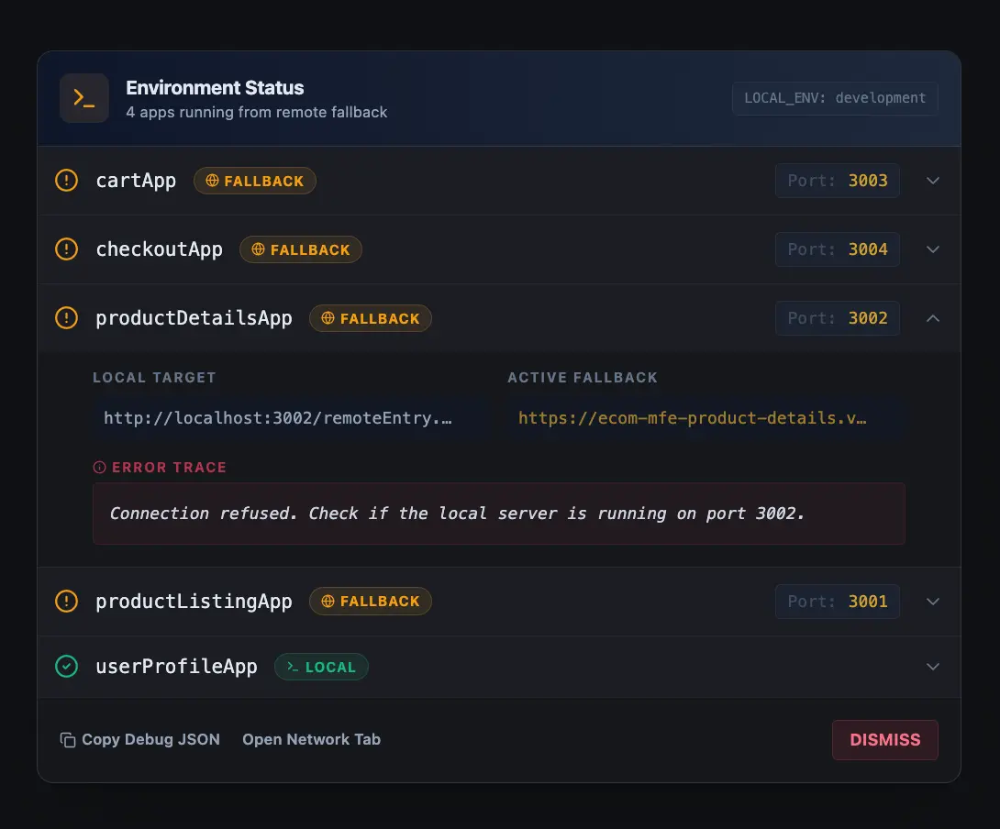
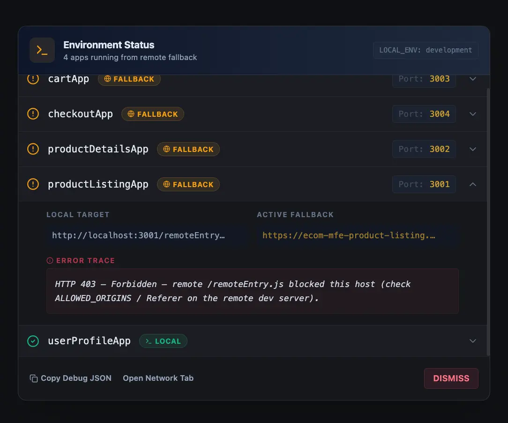

# Module Federation: remote fallback and Environment Status UI

This monorepo supports **local-first** Module Federation remotes in development, with an optional
**deployed `remoteEntry.js` fallback** when a local dev server is down, blocked, or misconfigured.
When fallback is enabled, the host also exposes a small **Environment Status** widget and panel so
you can see what actually loaded and why.

## How fallback works (runtime)

1. **Build time (host only, development)**  
   If `ENABLE_REMOTE_FALLBACK` is truthy, each remote in `apps/host/federation.config.js` is set to
   a **promise remote** built by `makeRemoteWithFallback(scope, localUrl, fallbackUrl)` from
   `@repo/rspack-config/utils`. That string is passed through unchanged into the Module Federation
   plugin (see `createRemoteEntries` in `packages/rspack-config/src/rspack.dev.js`).

2. **Runtime (browser)**  
   The generated promise:
   - Injects a `<script>` for the **local** `remoteEntry.js` first.
   - On **success**, it resolves the federated container and records which URL won in
     `globalThis.__MF_REMOTE_RESOLUTION__[scope]`.
   - On **failure** (timeout, network error, script error, etc.), it:
     - Optionally **probes** the local URL with `fetch` (HEAD, then GET) to capture an HTTP status
       when CORS allows it.
     - Writes diagnostic fields on the same map (`localUrl`, `localHttpStatus`, `localFailureNote`,
       `localLikelyOffline`, etc.).
     - Loads the **fallback** (deployed) `remoteEntry.js` and resolves the container from that URL.
   - Dispatches `CustomEvent('mf:remote-resolved', { detail: { scope, ... } })` whenever resolution
     data is merged (see `mergeResolution` in `packages/rspack-config/src/utils.js`).

3. **Production / staging**  
   The host uses plain `scope@url` remotes pointing at deployed `remoteEntry.js` URLs only. There is
   **no** runtime promise fallback in those environments.

## How to control fallback

| Control                      | Where                                                       | Effect                                                                                                                                                                                                                                                     |
| ---------------------------- | ----------------------------------------------------------- | ---------------------------------------------------------------------------------------------------------------------------------------------------------------------------------------------------------------------------------------------------------- |
| `ENABLE_REMOTE_FALLBACK`     | Host `.env.development` (e.g. `apps/host/.env.development`) | When `true` / `1` / `yes` / `on`, host dev remotes use `makeRemoteWithFallback`. When off, remotes are **local URLs only** (same shape as `localRemotes` in `federation.config.js`).                                                                       |
| `*_REMOTE_URL_LOCAL`         | Host env                                                    | Local `remoteEntry.js` URL per scope (e.g. `PRODUCT_LISTING_REMOTE_URL_LOCAL`).                                                                                                                                                                            |
| `*_REMOTE_URL`               | Host env                                                    | Deployed fallback `remoteEntry.js` URL per scope.                                                                                                                                                                                                          |
| `MF_REMOTE_LOCAL_TIMEOUT_MS` | Optional, read inside generated promise                     | Milliseconds before local script load is aborted (default **800** in `utils.js`).                                                                                                                                                                          |
| `PORT`                       | Host env                                                    | Used for dev `publicPath` (`http://localhost:${PORT}`) in `federation.config.js`.                                                                                                                                                                          |
| `ALLOWED_ORIGINS`            | Host and remotes                                            | Comma-separated list of origins allowed to load a remote’s `remoteEntry.js` when using the origin guard helper (`createRemoteEntryOriginGuard`). Misconfiguration often surfaces as **403** on local `remoteEntry.js` and triggers fallback + diagnostics. |

Example host dev env keys: `apps/host/.env.development` (`ENABLE_REMOTE_FALLBACK`, local + deployed
URLs).

## `__MF_REMOTE_RESOLUTION__` and `mf:remote-resolved`

These are the **contract** between the Rspack-generated promise remote and the host UI.

- **`globalThis.__MF_REMOTE_RESOLUTION__`**:
  `Record<scope, { url?, source?, resolvedAt?, localUrl?, localHttpStatus?, localFailureNote?, localLikelyOffline? }>`.
- **`mf:remote-resolved`**: Fired when that map is updated; the Environment Status panel listens to
  refresh its view.

You can inspect the map in DevTools → Console: `globalThis.__MF_REMOTE_RESOLUTION__`.

## Environment Status UI (mf-environment-status)

**Location:** `apps/host/src/components/mf-environment-status/`  
**Mounted from:** `apps/host/src/index.tsx` (`<MfEnvironmentStatusPanel />` next to `<App />`).

## Screenshots

**Environment Status panel (overview)**

**Fallback when local dev server is not running**

**Fallback when local exists but is blocked by CORS / forbidden responses**

### Behavior

- **Dev only:** The panel returns `null` when `getClientMode()` is not `'development'` (see
  `utils.ts`: `process.env.NODE_ENV` first, then safe `import.meta.env.MODE`).
- **When it appears:** The small **50×50 circular widget** (bottom-right) and the full **Environment
  Status** sheet only render when `panelVisibility()` says there is something worth showing: at
  least one tracked remote entry **and** either at least one scope is on **fallback**
  (`isFallbackRow`: `source` is set, not `'local'`, and `url` is present) or there is a **local
  diagnostic** (failure note, 403, or HTTP ≥ 400 on the local probe). See `panelVisibility` in
  `utils.ts`.
- **Widget vs panel:** The widget opens the full panel on click. **Dismiss** hides the UI for the
  current page session (in-memory `dismissed` state; a full reload shows it again if visibility
  conditions still hold).

### Styling

Banner styles live next to the component: `MfEnvironmentStatusPanel.css`, imported from
`MfEnvironmentStatusPanel.tsx` (not in global `apps/host/src/index.css`).

### Actions in the footer

- **Copy debug JSON** — serializes `{ capturedAt, mode, remotes: __MF_REMOTE_RESOLUTION__ }`.
- **Open Network Tab** — copies a short DevTools tip (filter `remoteEntry`).

### Turning the UI off

- Remove `<MfEnvironmentStatusPanel />` from `apps/host/src/index.tsx`, or
- Gate it behind your own flag (not present by default in this repo).

## Debugging checklist

1. **Network tab** — Look for the `remoteEntry.js` request: failed local load, CORS, 403, wrong
   host/port.
2. **Fallback off** — Set `ENABLE_REMOTE_FALLBACK=false` to force **local only** and surface hard
   failures immediately.
3. **403 / Referer** — Align `ALLOWED_ORIGINS` on remotes with the host origin; see
   `createRemoteEntryOriginGuard` in `packages/rspack-config/src/utils.js`.
4. **`publicPath`** — Remote chunks must resolve correctly; trailing slash on `publicPath` matters
   for chunk URLs.

## Related code

- `packages/rspack-config/src/utils.js` — `makeRemoteWithFallback`, `createRemoteEntryOriginGuard`,
  `truthy`
- `apps/host/federation.config.js` — wires env vars into promise vs local-only remotes
- `apps/host/src/components/mf-environment-status/` — React panel, types, helpers
